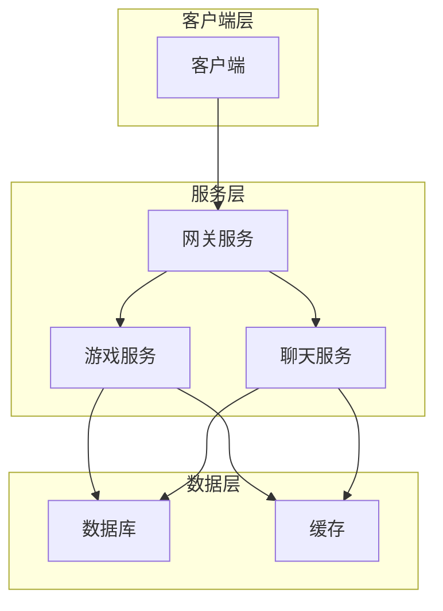

<!--
文档名称: 项目架构概览
创建时间: {{create_time}}
最后修改时间: {{last_modify_time}}
最后修改内容: {{last_modify_content}}
修改人: {{author}}
版本: {{version}}
项目类型: {{project_type}}
-->

# 项目架构概览

## 1. 项目概述

### 1.1 项目简介

### 1.2 技术栈

## 2. 架构设计

### 2.1 整体架构

### 2.2 核心模块

## 3. 模块划分

## 4. 关键流程

## 5. 部署架构

## 6. 扩展性考虑

## 7. 性能优化

## 8. 安全考虑