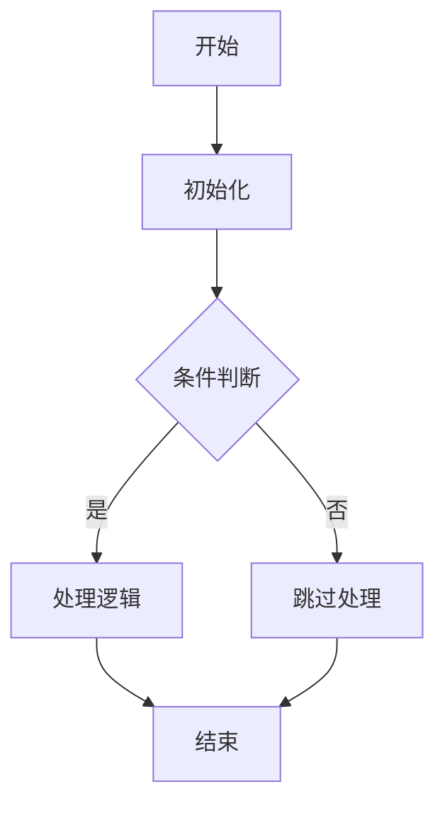
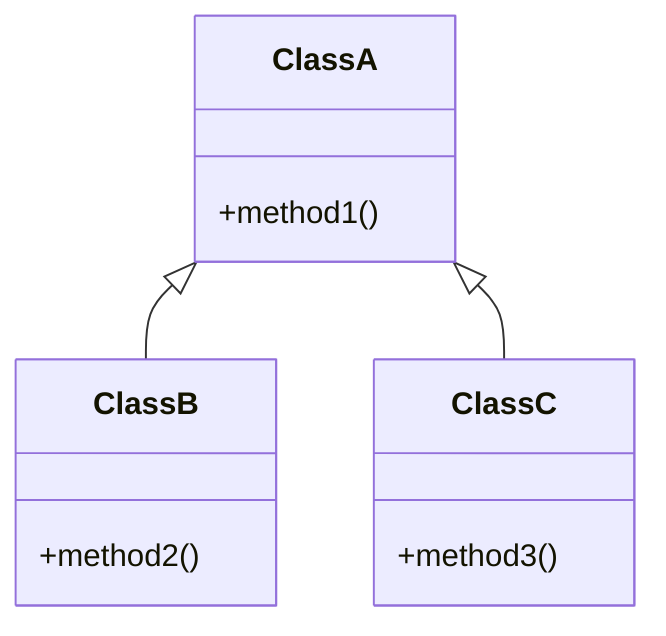

<!--
文档名称: {{module_name}}详细功能设计文档
创建时间: {{create_time}}
最后修改时间: {{last_modify_time}}
最后修改内容: {{last_modify_content}}
修改人: {{author}}
版本: {{version}}
项目类型: {{project_type}}
-->

# {{module_name}}详细功能设计文档

## 1. 功能概述

### 1.1 功能描述

### 1.2 模块定位

## 2. 实现思路

### 2.1 设计思路

### 2.2 实现方案

## 3. 核心类与接口

### 3.1 核心类

### 3.2 关键接口

## 4. 重点实现代码

### 4.1 核心功能实现

```java
// 示例代码
public class ExampleClass {
    // 核心方法实现
    public void coreMethod() {
        // 实现逻辑
    }
}
```

### 4.2 关键算法

## 5. 流程图



## 6. 类关系图



## 7. 使用说明

### 7.1 基本使用

### 7.2 示例代码

## 8. 配置说明

### 8.1 配置项

### 8.2 配置方法

## 9. 常见问题

### 9.1 问题列表

### 9.2 解决方案

## 10. 性能考虑

### 10.1 性能优化

### 10.2 性能测试

## 11. 依赖关系

### 11.1 内部依赖

### 11.2 外部依赖

## 12. 扩展性考虑

### 12.1 可扩展点

### 12.2 未来规划

## 13. 测试策略

### 13.1 测试方法

### 13.2 测试用例

## 14. 部署说明

### 14.1 部署方式

### 14.2 注意事项

## 15. 版本历史

## 16. 维护指南

### 16.1 维护方法

### 16.2 注意事项