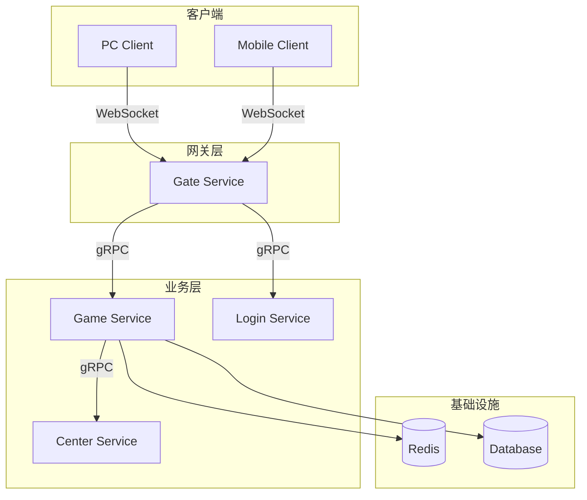
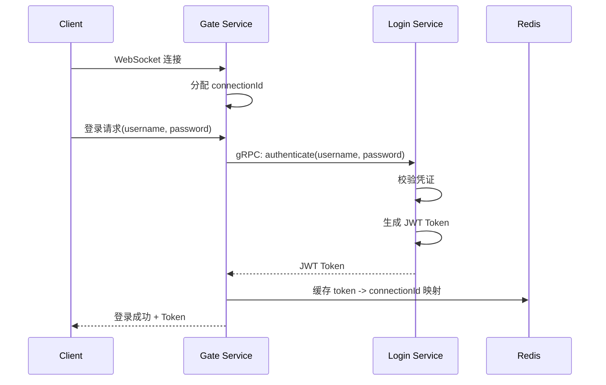
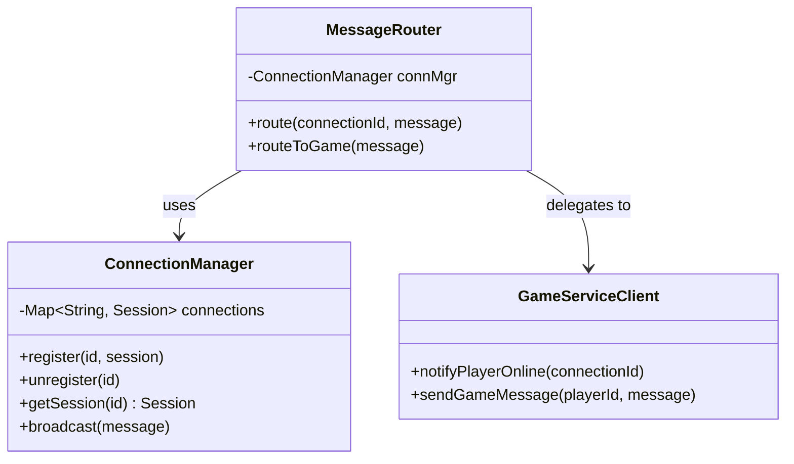
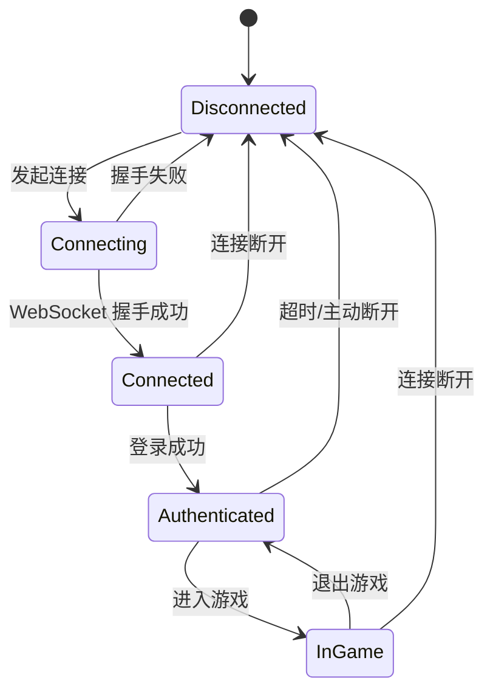
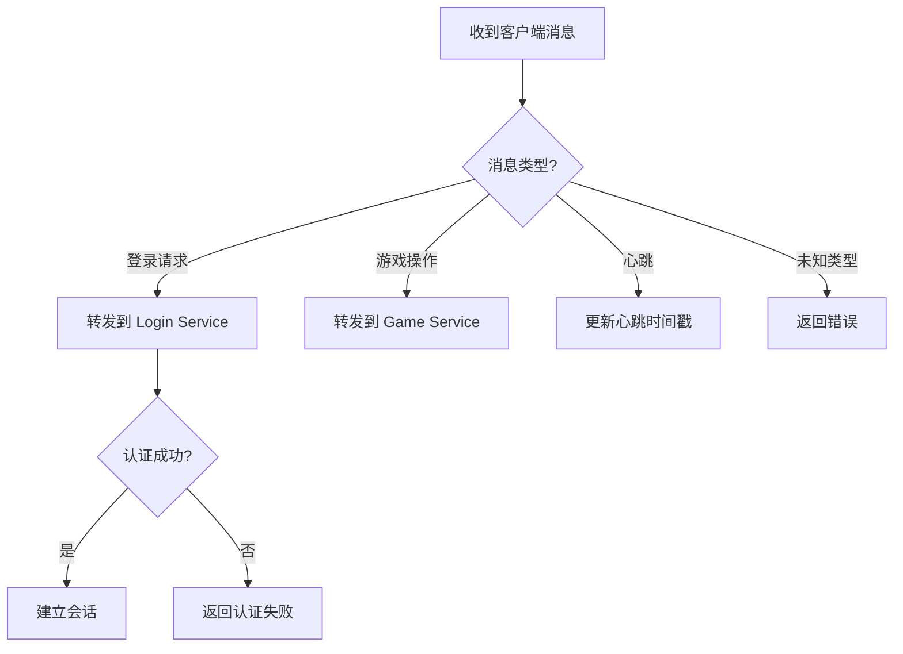

# Mermaid 图表模式库

本文档提供教程中常用的 Mermaid 图表模式和绘图描述格式规范。Skill 在 Phase 4 中参考此文档生成图表。

---

## 使用原则

1. **能用 Mermaid 的优先用 Mermaid** — 可直接在 Markdown 中渲染
2. **Mermaid 不能表达的用绘图描述** — 生成足够精确的描述，供手绘或绘图 AI 使用
3. **每章至少一个图表** — 优先使用能最好辅助理解的图表类型
4. **图表要有标题和说明** — 图表前后配 1-2 句文字说明

---

## Mermaid 图表模式

### 模式一：架构模块关系图（flowchart）

适用：展示系统组成和模块间关系。

````markdown

````

### 模式二：服务调用时序图（sequenceDiagram）

适用：展示多个组件间的调用顺序和交互。

````markdown

````

### 模式三：类/模块依赖图（classDiagram）

适用：展示核心类之间的关系。

````markdown

````

### 模式四：状态机图（stateDiagram-v2）

适用：展示对象或流程的状态变迁。

````markdown

````

### 模式五：版本演进线（gitgraph）

适用：展示项目迭代的版本演进路径。特别适合教程中的"全局路线图"。

````markdown
```mermaid
gitgraph
    commit id: "最小通信"
    commit id: "服务拆分"
    branch security
    commit id: "JWT 认证"
    commit id: "TLS 加密"
    checkout main
    merge security id: "安全体系完成"
    commit id: "限流熔断"
    commit id: "可观测性"
    commit id: "K8s 部署"
```
````

### 模式六：流程决策图（flowchart with conditions）

适用：展示带条件判断的流程。

````markdown

````

---

## 绘图描述格式规范

当 Mermaid 无法表达所需图表时（如部署拓扑含物理设备图标、复杂 UI 交互、性能对比柱状图等），使用以下结构化描述格式：

### 格式模板

```markdown
> **[图表类型] 图表标题**
>
> **布局**: [描述整体布局方式——左右结构/上下分层/环形/自由布局]
>
> **元素**:
> - [元素1名称]（[形状/图标]）: [描述]
> - [元素2名称]（[形状/图标]）: [描述]
> - ...
>
> **连接**:
> - [元素A] →([连接类型/标签]) [元素B]
> - [元素C] ↔([连接类型/标签]) [元素D]
> - ...
>
> **标注**:
> - [位置/元素]: [标注文字]
> - ...
>
> **配色/风格建议**: [可选，提供视觉建议]
```

### 示例一：部署拓扑图

```markdown
> **[部署拓扑图] 生产环境部署架构**
>
> **布局**: 上下三层结构
>
> **顶层（接入层）**:
> - 负载均衡器（云图标）: Nginx / Cloud LB，负责 SSL 终止和流量分发
> - 标注: "公网入口，TLS 加密"
>
> **中间层（服务层）**:
> - Gate Service × 3（服务器图标）: 水平排列，每个标注实例编号
> - Game Service × 2（服务器图标）: 水平排列
> - Login Service × 1（服务器图标）
> - Center Service × 1（服务器图标）
> - 标注: "K8s Pod，支持自动扩缩容"
>
> **底层（存储层）**:
> - Redis Cluster（数据库图标，红色）: 3 主 3 从
> - MySQL（数据库图标，蓝色）: 主从模式
>
> **连接**:
> - 负载均衡器 →(WebSocket) Gate Service（所有实例）
> - Gate Service →(gRPC) Game Service / Login Service
> - Game Service →(gRPC) Center Service
> - Game Service →(TCP) Redis Cluster
> - Game Service →(JDBC) MySQL
>
> **配色建议**: 接入层蓝色调，服务层绿色调，存储层橙色调
```

### 示例二：性能对比图

```markdown
> **[柱状对比图] 认证方案性能对比**
>
> **布局**: 水平柱状图，两组对比
>
> **X 轴**: 请求量（req/s）
> **Y 轴**: 两个方案
>
> **数据**:
> - Session 认证: 12,000 req/s（蓝色柱）
> - JWT 认证: 28,000 req/s（绿色柱）
>
> **标注**:
> - JWT 柱上方: "+133% 吞吐量提升"
> - 底部说明: "测试环境: 4C8G, JDK 17, 100 并发连接"
```

---

## 图表选择指南

| 要展示的内容 | 推荐图表类型 | Mermaid 可否 |
|-------------|-------------|-------------|
| 系统模块组成和关系 | flowchart | ✅ |
| 服务间调用顺序 | sequenceDiagram | ✅ |
| 核心类关系 | classDiagram | ✅ |
| 对象/流程状态变迁 | stateDiagram-v2 | ✅ |
| 项目版本演进线 | gitgraph | ✅ |
| 带条件的处理流程 | flowchart (TD) | ✅ |
| 部署拓扑（含物理设备） | 绘图描述 | ❌ |
| UI 交互流程 | 绘图描述 | ❌ |
| 性能对比图表 | 绘图描述 | ❌ |
| 数据流全景（多层嵌套） | 绘图描述 | ❌ |
| 网络分区/多机房 | 绘图描述 | ❌ |
